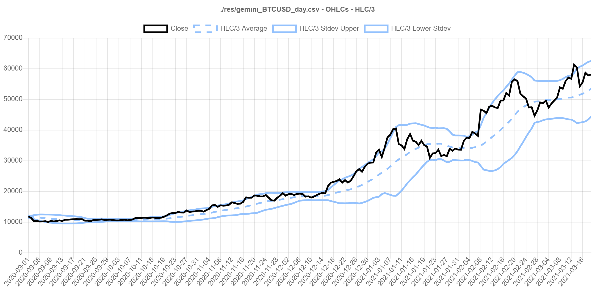
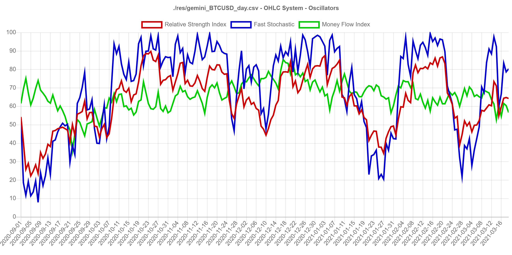

# Node.js Data-Oriented Design Benchmark

Performs an Object-Oriented Design vs. Data-Oriented Design benchmark for the problem of calculating financial algorithms on cryptocurrency time-series data. Timings are written to log. When finished, writes sample data for charts and runs an http-server.

## Quickstart

We're using the more recent versions of Node.js because some other experiments were performed using [n-api](https://nodejs.org/api/n-api.html) and [@thi.ng/simd](https://www.npmjs.com/package/@thi.ng/simd). To run:

```bash
$ nvm use 15.12.0
$ npm install
$ node index.js
```

## Problem Domain

[Technical Analysis](https://en.wikipedia.org/wiki/Technical_analysis) is a concept in the financial markets, such as stock market and cryptocurrency exchanges, referring to studies of transformations of trade price and volume. We use this domain to implement a benchmark that tests two orthogonal software design approaches: [Object-Oriented Design](https://en.wikipedia.org/wiki/Object-oriented_design) and [Data-Oriented Design](https://en.wikipedia.org/wiki/Data-oriented_design). The latter approach is lesser known, and became more popular with the efforts of video game engine developers. The objective of Data-Oriented Design is to maximize the throughout of computer hardware processing by designing solutions as a series of data transforms. Due to the [principle of locality](https://en.wikipedia.org/wiki/Locality_of_reference), it can be leveraged at most levels of abstraction, including virtualization.

OHLC Sample data for Bitcoin (BTC/USD) was downloaded in CSV format from [Crytpo Data Download](http://www.cryptodatadownload.com/data/gemini/). We perform the following calculations using both software design approaches:

* [Typical Price](https://en.wikipedia.org/wiki/Typical_price)
* [Bollinger Bands](https://en.wikipedia.org/wiki/Bollinger_Bands)
* [Relative Strength Index](https://en.wikipedia.org/wiki/Relative_strength_index)
* [Fast Stochastic](https://en.wikipedia.org/wiki/Stochastic_oscillator)
* [Money Flow Index](https://en.wikipedia.org/wiki/Money_flow_index)





To add to the amount of processing the benchmark does, calculations also are performed to find the median value for several data sets. Finding the median requires a data sort, so it is a good problem to stress the benchmark.

## Analysis

We implement a processing solution using both Object-Oriented Design and Data-Oriented Design. The most important aspect of the approach is choice of memory layout. We consider the difference between [Array-of-Structs and Struct-of-Arrays](https://en.wikipedia.org/wiki/AoS_and_SoA). Array-of-Structs (AoS) design interleaves heterogenous data in groups, whereas Struct-of-Arrays (SoA) design separates homogenous data in arrays. Generally we will consider AoS to be an Object-Oriented approach and SoA to be a Data-Oriented approach.

### Array-of-Structs: Object-Oriented Design

To illustrate, we model OHLC (Open, High, Low, Close) price data used in financial markets as a class encapsulation of values.

```js
class Ohlc {
  constructor ({ date, open, high, low, close, volume } = {}) {
    this.date = date
    this.open = open
    this.high = high
    this.low = low
    this.close = close
    this.volume = volume
  }
}
```

 The actual implementation contains more values, and in a  typical Object-Oriented Design the fields likely would have more encapsulation, but to demonstrate performance differences we keep the model flat so it has the least indirection and best chance to compete.

### Struct-of-Arrays: Data-Oriented Design

The Data-Oriented Design implements a system based on arrays of separate OHLC arrays, i.e. Struct-of-Arrays. It is important to note that the memory is allocated in a common [memory arena](https://en.wikipedia.org/wiki/Region-based_memory_management) which maximizes locality as memory is usually managed by pages in the operating system and we want to avoid segmentation.

Also note that it is common for highly interdependent types of data to interleave values in one array, such as 2D and 3D world-space vectors. Here we keep all values separate to illustrate performance differences.

```js
class OhlcSystem {
  constructor (capacity) {
    this.length = 0

    // use a Memory Arena to maximize memory locality:
    // https://en.wikipedia.org/wiki/Region-based_memory_management
    // For more general problems, this becomes the limit for our batch size,
    // and we process our calculations in batches.
    const buffer = new ArrayBuffer(5 * capacity * Float64Array.BYTES_PER_ELEMENT)
    function mapTo (i) {
      return new Float64Array(buffer, i * capacity * Float64Array.BYTES_PER_ELEMENT, capacity)
    }
    this.opens = mapTo(0)
    this.highs = mapTo(1)
    this.lows = mapTo(2)
    this.closes = mapTo(3)
    this.volumes = mapTo(4)
  }
}
```

The idea of modelling such an approach as a "system" is based on the concept of [Entity Component Systems](https://en.wikipedia.org/wiki/Entity_component_system).

* An *entity* is represented by an identifier (e.g. an integer ID) that maps to components.
* A *component* is a property of one or more entities represented by data.
* It is a *system* for which calculations are  updated in batches.

ECS systems are best implemented as arrays of data transformations where component data is stored in arrays, hence it is an example of a Data-Oriented design approach. Calculation dependencies are ordered semantically between arrays, and transformations happen array-by-array.

### Rationale

A useful resource when thinking about software performance is [Latency Numbers Every Programmer Should Know](https://gist.github.com/jboner/2841832). These are back-of-the-envelope figures which are generally true across modern computing architectures. Differences between orders of magnitude between different types of cache and memory can be startling when viewing them as animations.

In addition to maximizing memory cache locality, Data-Oriented solutions also tend to maximize instruction cache (icache) locality, since they perform the same operations many times one or more arrays when calculating a "system component".

Data-Oriented Design is an approach to highly computational problems, but using it as a conceptual tool can be just as useful. For example, using a SQL statement to only select one column from a database as opposed to using an ORM mapped to a full data model will result in different performance profiles.

Data-Oriented Design is good for any problem that is processing intensive: data transformations, [ETL](https://en.wikipedia.org/wiki/Extract,_transform,_load) calculations, image processing, machine learning, deeplearning AI, simulation engines, and others.

It may not be a good solution for problems that are general or event-driven, such as generalized scripting, rules-based logic, and most web platform backends which model highly interlaced information that must be queried ad-hoc such as user management. In these cases, flexibility is often more advantageous as optimization effort will begin to have diminishing returns.

## Implementation

We use a simple Node.js setup:

* configuration: [dotenv](https://www.npmjs.com/package/dotenv)
* logging: [winston](https://www.npmjs.com/package/winston)
* automatic code formatting: [standard.js](https://standardjs.com/)

The entrypoint into the application is `index.js` and logic is delegated to:

* `./src/util` - utility classes containing static, stateless functions
* `Ohlc` - Object-Oriented model containing data for one OHLC instance
* `OhlcSystem` - Data-Oriented system (based on ECS) composing arrays of data for a series of OHLCs

After running a benchmark based on the CSV file configured in `.env`, the application runs a Node http server to render charts with [Chart.js](https://www.chartjs.org/).

Chart data is sampled to make chart visualization easier. We sample two ways (see `.env`):
1. `CHART_SAMPLES` - evenly distributed sample count
2. `CHART_TAIL` - the most recent sampled values (zero to disable)

### CSV Parsing Considerations

Initially, we use [NodeCSV](https://www.npmjs.com/package/csv) to parse the CSV files, but CSV parsing takes a considerable amount of the processing time. To optimize, we also provided a manual parser which is indeed faster, but at maintenance cost. In a real-world solution we should consider:

* What requirements do we have regarding how data is stored? Do we need CSV or can we use a binary format?
* Using a library greatly reduces future maintenance cost
* Sometimes, a custom solution is not inherently difficult. The custom solution in `ohlc_utils.js` uses a doubly-nested loop but this logic can be delegated to internal libraries and unit tested. See [RFC 4180](https://tools.ietf.org/html/rfc4180#section-2).

For our large test file, the CSV parser library takes 10.08 seconds to run both benchmarks whereas the custom solution takes 6.86 seconds and is approximately 1.5 times faster. The reason the custom solution is faster likely is because there are far less event-driven callbacks passed between transformers, so there is fewer indirection. The parser can be toggled with the config option `USE_OPTIMIZED_CSV_PARSE`.

## Results

Example results for `res/gemini_BTCUSD_2020_1min.csv` using `CALC_WINDOW` of 20:

```json
stats: {
  "lineCountSeconds": 0.14650689999759198,
  "ohlcs": {
    "parseOhlcsFromCsvSeconds": 3.4075680999904874,
    "calculateAllSeconds": 6.010672399997711,
    "writeOhlcsSamplesSeconds": 0.003225700005888939
  },
  "ohlcSystem": {
    "parseOhlcsFromCsvSeconds": 3.4495963999927044,
    "calculateAllSeconds": 2.313260899990797,
    "writeOhlcsSamplesSeconds": 0.007214100003242492
  }
}
```

We are primarily interested in the difference between `calculateAllSeconds` for `ohlcs` (Object-Oriented Design) and `ohlcSystem` (Data-Oriented Design). The former takes 6.01 seconds and the latter takes 2.31 seconds. For simply reordering the data in memory to leverage CPU cache architectures, we can process the data approximately 2.6 times faster.

Note that several calculations range across a window of n-periods. This means there is a tight inner-loop that ranges across the window size. Our results are different if we increase the window size to 200:

```json
stats: {
  "lineCountSeconds": 0.1463555999994278,
  "ohlcs": {
    "parseOhlcsFromCsvSeconds": 3.247934799998999,
    "calculateAllSeconds": 10.200312600001693,
    "writeOhlcsSamplesSeconds": 0.0034536000043153764
  },
  "ohlcSystem": {
    "parseOhlcsFromCsvSeconds": 3.3336841000020505,
    "calculateAllSeconds": 6.135633900001645,
    "writeOhlcsSamplesSeconds": 0.005962599992752076
  }
}
```

In both cases total time increases, but the ratio is closer: 10.20 seconds vs. 6.14 seconds or 1.7 times faster for the Data-Oriented approach. Increasing the window size means more time is spent in cache for both approaches since there is more locality.

## Further Improvements

If we want to optimize this problem further, we're just scratching the surface. The first consideration is if we really need 64-bit floats for our calculations. In many cases (including this one) 32-bit floats have enough accuracy for the problem. If we use `Float32Array` instances in `OhlcSystem` instead, we have a higher liklihood of being able to support SIMD.

[Single instruction, multiple data (SIMD)](https://en.wikipedia.org/wiki/SIMD) implementations are available on almost all modern computing architectures and allow us to exploit instruction-level parallelism. Effectively, SIMD operates on wide registers of 128 bits and higher, which allows us to perform operations such as a single multiplication instruction on four 32-bit floats. Commonly they are accessed via [C Intrinsics](https://software.intel.com/sites/landingpage/IntrinsicsGuide/). One approach to using SIMD in Node.js is to use [n-api](https://nodejs.org/api/n-api.html) to access them natively.

But using Data-Oriented approaches on 32-bit float arrays allows compilers, JITs, and hotspot optimizers to perform [Automatic vectorization](https://en.wikipedia.org/wiki/Automatic_vectorization). When a compiler performs auto-vectorizes, it automatically converts instructions to SIMD instructions. In ideal situations this can makes tight loops 4, 8, or 16 times faster. Auto-vectorization can be inconsistent, however, since it might only activate for simple loops. Generally, it's nice to have but we shouldn't be rely on it.

Access to SIMD has been targetted by [WebAssembly SIMD](https://github.com/WebAssembly/simd). In particular, one nice abstraction library is [@thi.ng/simd
](https://www.npmjs.com/package/@thi.ng/simd) which compiles using [AssemblyScript](https://www.assemblyscript.org/). Currently, SIMD is accessible through @thi.ng/simd from Node version 14.6.0.

Finally, if our problem is highly parallelizable, we can consider frameworks like [CUDA](https://developer.nvidia.com/cuda-toolkit) that leverage the GPU.

## References

* [Data-Oriented Design by Richard Fabian](https://www.dataorienteddesign.com/dodbook/)
* [High Performance JavaScript via Data Oriented Design](https://www.thomcc.io/2015/09/06/high-performance-javascript.html)
* [Latency Numbers Every Programmer Should Know](https://gist.github.com/jboner/2841832)
* [CppCon 2014: Mike Acton "Data-Oriented Design and C++"](https://www.youtube.com/watch?v=rX0ItVEVjHc&ab_channel=CppCon)
* [CppCon 2014: Chandler Carruth "Efficiency with Algorithms, Performance with Data Structures"](https://www.youtube.com/watch?v=fHNmRkzxHWs&ab_channel=CppCon)
* [Improving performance with SIMD intrinsics in three use cases](https://stackoverflow.blog/2020/07/08/improving-performance-with-simd-intrinsics-in-three-use-cases/)
* [Beginners guide to writing NodeJS Addons using C++ and N-API (node-addon-api)](https://medium.com/@a7ul/beginners-guide-to-writing-nodejs-addons-using-c-and-n-api-node-addon-api-9b3b718a9a7f)
* [How to call C/C++ code from Node.js](https://medium.com/@koistya/how-to-call-c-c-code-from-node-js-86a773033892)
* [Supercharging the TensorFlow.js WebAssembly backend with SIMD and multi-threading](https://blog.tensorflow.org/2020/09/supercharging-tensorflowjs-webassembly.html)